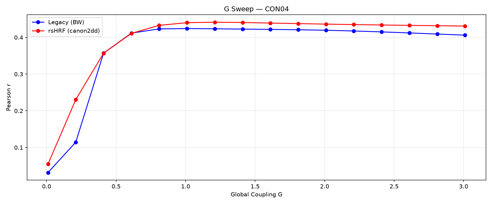
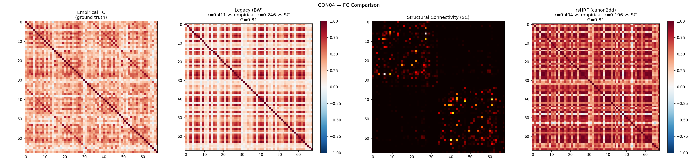
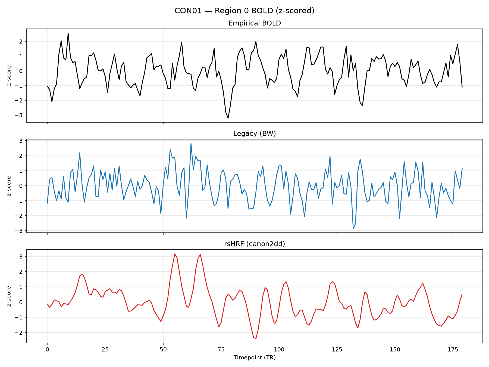
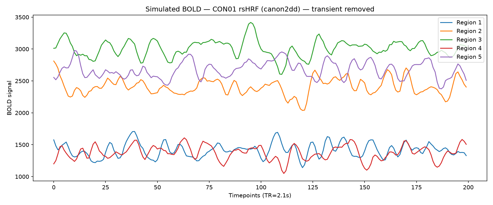
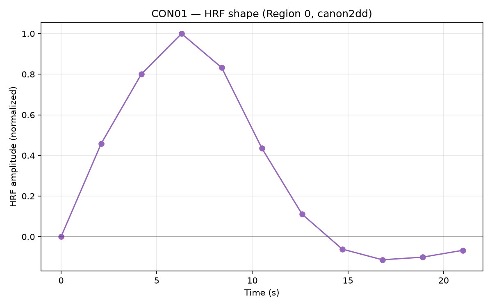
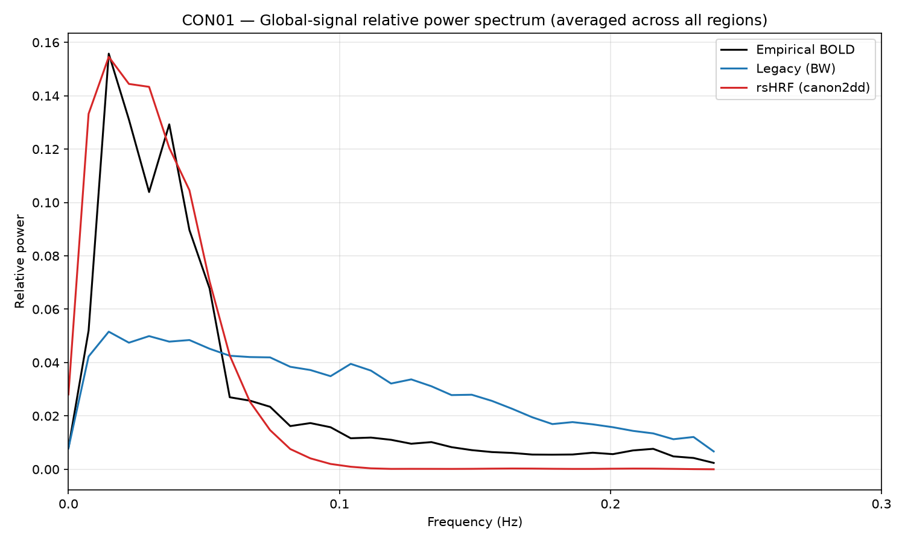
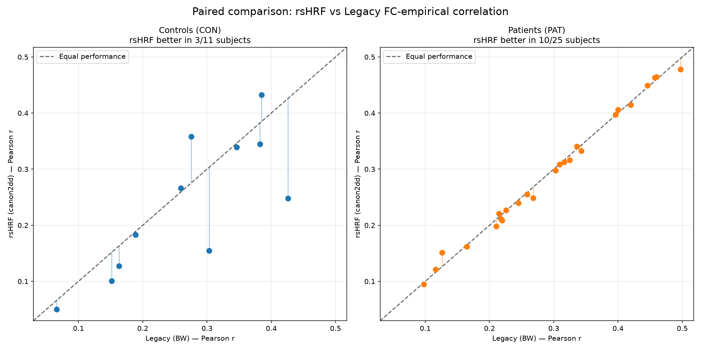
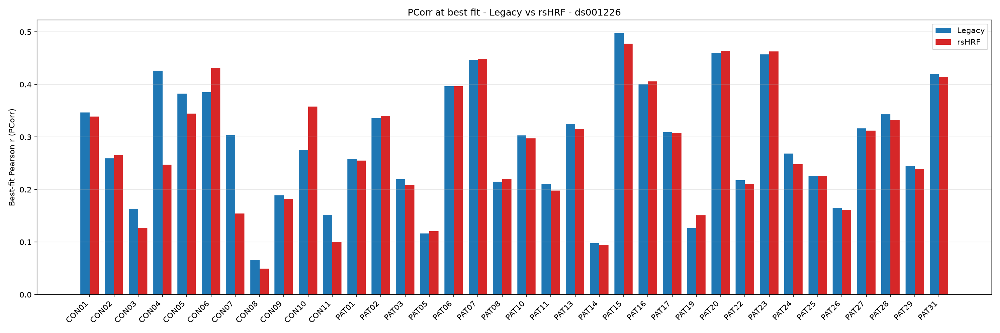
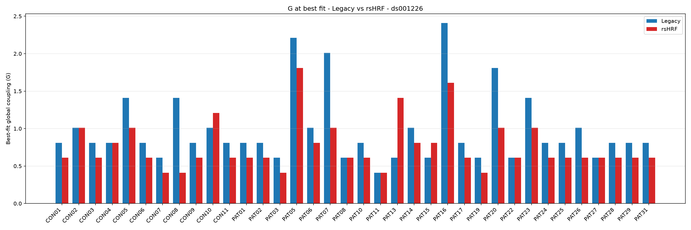
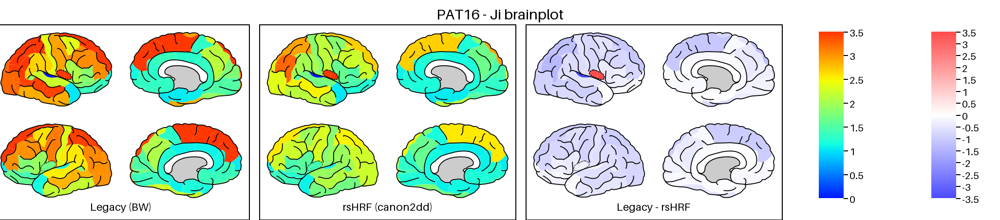

# Integrating personalized hemodynamic response function in The Virtual Brain & EBRAINS

This project took place over the summer of 2026 as part of Google Summer of Code, under Professor Daniele Marinazzo, addressing a known limitation in The Virtual Brain (TVB): TVB's standard BOLD monitor convolves simulated neural activity with a single, constant Hemodynamic Response Function (HRF) shared across every brain region and every subject. Since HRF shape is known to vary across both subjects and brain regions, using one fixed HRF for the whole brain risks attributing HRF-driven variability to neural activity instead.

The goal was to replace that constant HRF with a region- and subject-specific HRF, estimated per-subject from resting-state fMRI using the [rsHRF](https://github.com/bids-apps/rsHRF) toolbox, and convolve simulated neural activity with these curves instead of the default Balloon-Windkessel model.


## Project Setup

1. Open the project in VS Code.
2. Open a terminal and run `setup.bat`:
   ```
   .\setup.bat
   ```
3. After the above command executes successfully, activate the virtual environment:
   ```
   .\venv\Scripts\activate.bat
   ```
4. `--mode brain-plot` needs the native Cairo library, which
   `requirements.txt` can't install on its own - download and run the
   [GTK3 runtime installer](https://github.com/tschoonj/GTK-for-Windows-Runtime-Environment-Installer/releases),
   then close and reopen your terminal before reactivating the venv.

### macOS / Linux

Use `setup.sh` instead of `setup.bat`, and activate with:

```
source venv/bin/activate
```

`--mode brain-plot` also needs the native Cairo library here:
- **macOS** - `brew install cairo`
- **Linux (Debian/Ubuntu)** - `sudo apt install libcairo2`
  (Fedora: `sudo dnf install cairo`; Arch: `sudo pacman -S cairo`)

## Running the Pipeline

Once the virtual environment is activated:

```
python pipeline.py --dataset ds001226 --subject CON01
```

- `--dataset` - OpenNeuro dataset id (defaults to `ds001226`)
- `--subject` - run a single subject (e.g. `CON01`); omit to run all subjects
- `--G` - explicit G override. For `fc` mode: restrict the sweep to just
  this one G (omit for the full 16-point default sweep). For `bold` and
  `signal` modes: use this one G directly instead of resolving a best-fit
  G (omit to resolve it automatically, running `fc` first if needed).
- `--mode` - which stage(s) to run, space-separated: `fc`, `bold`,
  `signal`, `summary`, `brain-plot`. Defaults to `fc bold signal` if
  omitted - always in that order (`fc` first, so `bold`/`signal` have a
  best-fit G ready to use). `summary` and `brain-plot` never run unless
  explicitly selected.

Input data is read from `datasets/<dataset>/sub-<subject>/ses-preop/` and is
downloaded automatically via the AWS CLI if missing. Results are written to
`results/<dataset>/<subject>/outputs/G_sweep/`.

### Examples

```
python pipeline.py --dataset ds001226 --subject CON01                        # fc, bold, signal - full default run
python pipeline.py --dataset ds001226 --subject CON01 --mode fc              # fc only, full G sweep
python pipeline.py --dataset ds001226 --subject CON01 --mode bold            # bold only (needs a prior fc run, or pass --G)
python pipeline.py --dataset ds001226 --subject CON01 --mode signal          # signal only (self-sufficient - runs fc first if needed)
python pipeline.py --dataset ds001226 --subject CON01 --mode bold --G 0.41   # bold only, one explicit G for both methods
python pipeline.py --dataset ds001226 --subject CON01 --mode brain-plot      # brain-plot only (needs a prior fc run)
python pipeline.py --dataset ds001226 --mode summary                         # summary only, all subjects
```

## `fc` mode - FC sweep and comparison

Hand-rolled DMF + Balloon-Windkessel (Legacy) and DMF + FIC + rsHRF
convolution (rsHRF). For each G, computes Pearson r against the subject's
empirical FC, in parallel via `ProcessPoolExecutor` (one worker per G value).

For each G, also tracks **FC strength** - the mean off-diagonal value of
the simulated FC matrix. This is different from Pearson r: a G can score
well on r (pattern matches empirical FC) while still having a low-magnitude,
washed-out FC matrix that renders pale in `fc_comparison.png`. When
selecting the best-fit G, the pipeline picks the smallest G within
tolerance of the top r that *also* clears a minimum FC strength
(`FC_STRENGTH_MIN` in `pipeline.py`), so best-fit G's don't land on a pale
result purely by tolerance-tie luck.

FIC (feedback inhibition control) dynamically tunes each region's
inhibitory weight `J_i` for both methods - Legacy and rsHRF each converge
to their own, genuinely different, per-region `J_i` at their own best-fit G.

Writes to `results/<dataset>/<subject>/outputs/G_sweep/`:

- `PCorr_legacy.txt`, `PCorr_rshrf.txt`, `G_values.txt` - the raw Pearson r
  values for every G in the sweep, written incrementally as each G completes.
- `FCStrength_legacy.txt`, `FCStrength_rshrf.txt` - the FC strength value
  for every G, same order as the files above.
- `Ji_legacy.txt`, `Ji_rshrf.txt` - each method's converged per-region
  `J_i` at its own best-fit G - 68 values (one per DK68 region), not a
  mean and not a per-G sweep.
- `G_sweep.png` - Pearson r vs G, both methods, for that subject.

  

- `fc_comparison.png` - 4-panel comparison at each method's own best-fit G:
  Empirical FC (ground truth), Legacy (BW), Structural Connectivity (SC),
  rsHRF (canon2dd).

  

- `best_fc_legacy.npy`, `best_fc_rshrf.npy` - the simulated FC matrices at
  best fit.

## `bold` mode - BOLD at each method's best-fit G

Simulates BOLD (Legacy BW + rsHRF) **only at each method's own best-fit
G** - read from a completed `fc` sweep (`get_best_G_from_fc`, same
strength-aware selection as above) - not at every G in the sweep. If
Legacy and rsHRF share the same best-fit G, only one simulation runs; if
they differ, both run in parallel. Pass `--G` to override with one
explicit G for both methods instead (no prior `fc` run required in that
case).

Each simulation is 250 TRs, with the first 50 discarded as burn-in,
leaving 200 TRs of settled BOLD.

Writes exactly 2 plots to `results/<dataset>/<subject>/outputs/G_sweep/`
(no raw `.npy` saved in this mode):

- **`bold_region0_comparison.png`** - Region 0 only, z-scored, 3 stacked
  subplots: Empirical BOLD, Legacy (BW), rsHRF (canon2dd). Empirical BOLD
  has no burn-in and may be a different length than the simulated 200
  TRs (e.g. shorter real scans) - all three traces are truncated to
  their shortest common length so the shared x-axis stays honest.

  

- **`bold_regions1to5_transient_removed.png`** - Regions 1–5, rsHRF only,
  one combined figure (5 lines overlaid). The burn-in transient is
  already removed since the input is the post-discard 200-TR trace.

  

## `signal` mode - HRF shape and power spectrum

Two more ways to look at the same simulation: what shape of hemodynamic
response rsHRF actually fit for this subject, and how the resulting BOLD
signal is distributed across frequency compared to the real thing.

**Self-sufficient by design** - if no `fc` sweep has been run yet for the
subject, `signal` mode runs `fc` automatically first so it always has a
best-fit G to work with. It never stops at a half-finished result just
because `fc` hadn't been run. Pass `--G` to skip all of that and use an
explicit G directly instead.

**G resolution:** unlike `bold` mode (which can use two different G's,
one per method), `signal` mode resolves **one single G**, shared by both
Legacy and rsHRF - rsHRF's own best-fit G, using the same tolerance-based
"smallest G within tolerance of the top r" rule as everywhere else in the
pipeline (via `get_max_rshrf_G`), read straight off `G_values.txt` /
`PCorr_rshrf.txt`.

Writes to `results/<dataset>/<subject>/outputs/G_sweep/`:

- **`hrf_shape_region0.png`** - the canonical HRF curve (canon2dd) that
  was actually fit and used for this subject's rsHRF convolution,
  Region 0. Needs no simulation at all - it's just what's already
  sitting in the subject's data, so this part of `signal` mode is
  effectively instant regardless of anything else.

  

- **`bold_spectrum_global.png`** - Empirical, Legacy, and rsHRF power
  spectra, all three overlaid on one shared plot for direct comparison.
  Each is a **global-signal** spectrum: a Welch PSD is computed per
  region, then averaged across *all* regions (not just Region 0), giving
  one curve per method rather than a per-region breakdown. Each curve is
  then normalized to its own total power - **relative power**, not
  absolute - since Legacy/rsHRF's simulated units and Empirical's real
  % BOLD signal change sit at completely different absolute scales, and
  comparing raw absolute power would make one curve look artificially
  flat purely from a unit mismatch, not an actual difference in shape.
  With everything normalized onto the same 0–1 relative scale, all three
  curves are genuinely comparable, and the plot stays as one merged
  figure (no separate panels, no shaded fill) so they can be read
  against each other directly.

  

## `summary` mode - plots across subjects

Aggregates across all subjects that have completed an `fc` sweep, reading
directly from each subject's `PCorr_legacy.txt` / `PCorr_rshrf.txt` /
`G_values.txt` (and `FCStrength_*.txt`, if present, for the same
pale-avoidance selection) - no extra JSON file involved.

Omit `--subject` to summarize every subject with completed PCorr files, or
add it to summarize just one. Output goes to `results/<dataset>/summary/`:

- **`best_fit_paired_scatter.png`** - paired comparison of each subject's
  best-fit (max of the sweep curve) Legacy r vs rsHRF r, split into two
  panels (Controls / Patients), each with an "Equal performance" diagonal
  and a connector line from each point down to it.

  

- **`best_fit_parameter_differences.png`** - Legacy vs rsHRF best-fit
  Pearson r as a paired bar chart, one pair of bars per subject.

  

- **`best_fit_G_differences.png`** - the same paired-bar layout as
  `best_fit_parameter_differences.png`, but best-fit global coupling
  (`G`) instead of Pearson r - Legacy vs rsHRF, one pair of bars per
  subject. Read alongside the PCorr chart above to see whether a
  subject's fit quality tracks its coupling strength, or the two methods
  land on similar/different G's independently of how well either fits.

  

- **`brain_plot_Ji_<subject>.png`** (per-subject, via `--mode brain-plot`)
  - each subject's converged `J_i` mapped onto the DK68 brain atlas,
  3 panels: Legacy (BW), rsHRF (canon2dd), and `| Legacy - rsHRF |`, all
  on one shared 0-3.5 color scale so the panels are directly comparable.
  Needs the native Cairo library - see the GTK3 runtime / `brew` / `apt`
  step under [Project Setup](#project-setup) for your OS. Example for CON02:

  

## Is rsHRF better than Legacy?

**Using rsHRF improves the fit to empirical FC in most subjects.** Swapping
in rsHRF for the Legacy Balloon-Windkessel model raises the best-fit
Pearson r (i.e. produces a better match to each subject's real FC) in 19
of 36 subjects, versus 17 where Legacy still fits better. rsHRF can be
used as the preferred method. See `best_fit_paired_scatter.png` for the
full subject-by-subject breakdown.
